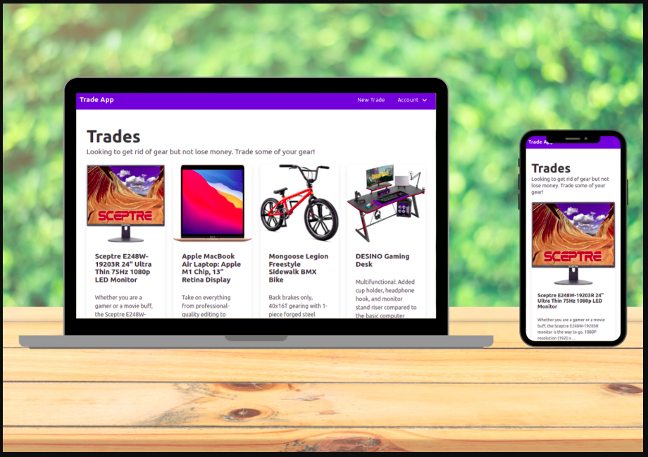

# Project :  Trade Stuff
Trade Stuff is a website where users can trade or exchange their belongings for a price or products from other users. This web application allows users to sign up using a name and email. An avatar will be assigned if not already linked to the account. Every logged-in user can create list of their stuffs and browse existing products listed by other users. Trade Stuff was built using Ruby On Rails, PostgreSQL, and Bootstrap.



## Live Demo

[Live Demo Link](https://trade-your-stuff.herokuapp.com/)

## Build-With

- Ruby -v 2.6.3
- Rails -v 5.2.0
- Postgresql
- VScode

## Getting Started

### Prerequisites

To get this project up and running locally, you must already have ruby and necessary gems installed on your computer

**To get this project set up on your local machine, follow these simple steps:**

1. Open Terminal.
2. Navigate to your desired location to download the contents of this repository.
3. Copy and paste the following code into the Terminal: git clone https://github.com/Abhigyan001/trade_stuff
4. Run ```cd trade_stuff```.
5. Run ```bundle install``` to get the necesary gems.
6. Run `rails db:create`.
6. Run `rails db:migrate`.
7. Run `rails server`


## Author Details::

👤 ABHIGYAN Mahanta

- Github: [@Abhigyan001](https://github.com/Abhigyan001)
- Twitter: [@abhigyan_001](https://twitter.com/abhigyan_001)
- LinkedIn: [Abhigyan](https://www.linkedin.com/in/abhigyanmahanta/)

## Show your support

Give ⭐ Star me on GitHub — it helps!

## 📝 License

This project is [MIT](lic.url) licensed.
